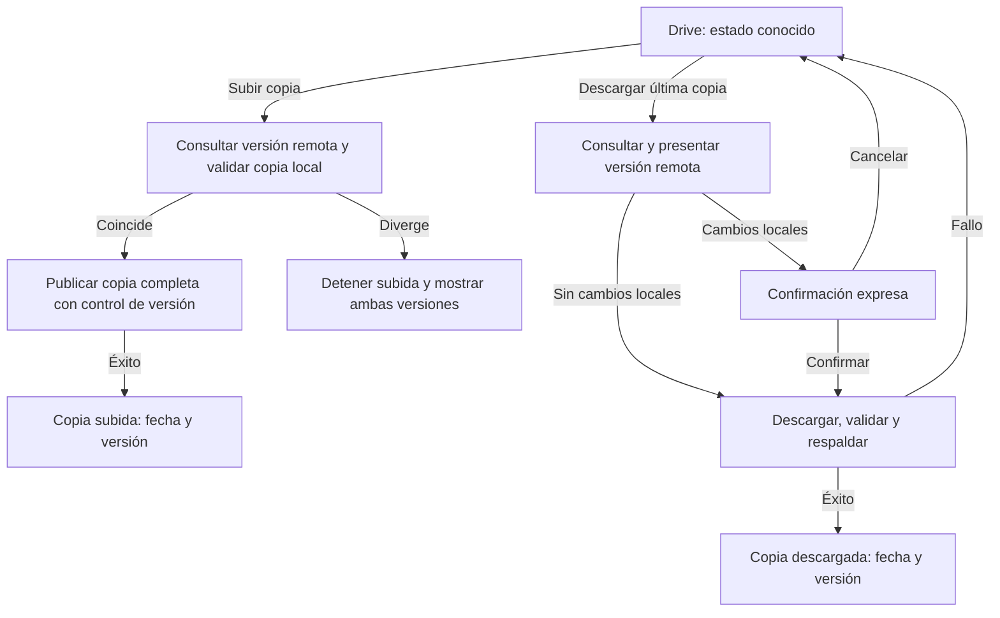

# MA-TSK-014 · Flujos críticos y estados de interfaz

**Estado:** guiones de interacción para EP-002. Sirven para construir y revisar el prototipo; no son pantallas implementadas ni aprobación del mockup MA-TSK-019. Se apoyan en el [mapa de navegación](mapa-navegacion.md), la [especificación aprobada](../ep-001/especificacion.md), el [contrato CSV](../ep-001/contrato-csv.md) y los [casos sintéticos](../ep-001/casos-referencia.md). Todos los ejemplos son sintéticos.

## Cómo recorrer los guiones

Cada enlace abre el guion indicado. Los códigos de estado permiten seguir el recorrido principal y sus desvíos dentro de cada tabla. **Resultado** describe lo que ve la persona al completar la acción; **error o salida** indica cómo recuperarse sin perder datos. `Volver` restaura el destino, año, mes, rama/celda y filtros de origen definidos en MA-TSK-013. Cancelar una edición descarta sus cambios. En Windows, la revisión de varios registros usa tabla compacta con fila y motivo; en Android, una tarjeta por registro con los mismos campos, acciones y estados. Los importes se muestran en EUR, con signo y dos decimales.

| Inicio | Camino principal | Desvíos comprobables |
|---|---|---|
| [CSV histórico](#csv-histórico-carga-y-previsualización) | C0 → C1 → C2 → C3/C4 → C5 | archivo inválido, referencia pendiente, posible duplicado, repetición exacta C6 |
| [XLS bancario](#xls-bancario-carga-y-previsualización) | X0 → X1 → X2 → X3 cuando exista adaptador aprobado | formato no admitido, fila inválida, posible solapamiento |
| [Categorización](#categorización-de-movimientos) | K0 → K1 → K2 → K3 | cancelar, categoría inválida |
| [Presupuesto](#propuesta-y-edición-del-presupuesto) | P0 → P1 → P2/P3 → P4; P5 cancela | ausencia de reales, conflicto padre/hijo, sustitución de partidas |
| [Foto del día 1](#foto-patrimonial-del-día-1) | F0 → F1 → F2; F3 corrige y F4 comprueba vigencia | foto ausente/incompleta, cero válido, valor inválido |
| [Drive](#copia-manual-en-drive) | D0 → U1 → U2/U3, o D0 → L1 → L2/L3 | versión desconocida, divergencia, cambios locales, fallo |

## CSV histórico: carga y previsualización

**Ruta:** Gestión → Importar CSV → `/importar/csv` → `/importar/csv/revision`. Es una importación de movimientos **y** partidas presupuestarias. La previsualización nunca escribe en la base. El botón `Confirmar importación` solo se habilita cuando el lote completo es válido y todas las referencias están resueltas.

| Estado | Estado inicial y acción | Resultado visible | Error o salida |
|---|---|---|---|
| C0 · Sin archivo | Se ve `Selecciona un CSV histórico` y un enlace al formato admitido. Pulsar `Elegir archivo`. | Se muestra nombre y empieza la validación local. | Cancelar selector mantiene C0; `Volver` conserva el origen. |
| C1 · Leyendo | Archivo seleccionado; mostrar progreso `Leyendo archivo…`, sin datos confirmados. | Pasar a C2 al terminar. | Si falla lectura: `No se pudo leer el archivo. Elige otro CSV.`; ninguna alta, se puede reintentar. |
| C2 · Revisión | Mostrar número de filas, altas reales y presupuestarias, cuentas y rutas por resolver, errores y posibles duplicados. Tabla/tarjetas con ordinal CSV, tipo, fecha, concepto, ruta, cuenta, importe del archivo e importe interno. Pulsar una incidencia. | Abre detalle con fila, valor y motivo; en presupuesto muestra expresamente `CSV +400,00 → guardado −400,00` o `CSV −3.000,00 → guardado +3.000,00`. | Cabecera, UTF-8, nueve campos, fecha, importe, jerarquía o regla de presupuesto inválidos: marcar fila y bloquear confirmación. `Cambiar archivo` vuelve a C0. |
| C3 · Resolver referencias | Elegir una cuenta o categoría existente, o confirmar alta. Para cada raíz nueva elegir explícitamente `Ingreso: sí/no`; aplicar la decisión a todas las filas que usan la misma referencia. | La revisión actualiza rutas y cuentas resueltas, conflictos y conteos; vuelve a C2. | Coincidencia ambigua o referencia pendiente: `Resuelve esta cuenta/categoría antes de importar`. No elegir automáticamente. Una ruta de cuarto nivel se rechaza. |
| C4 · Revisar solapamientos | Abrir `Posibles duplicados` si otro archivo contiene reales parecidos. Comparar ordinal, fecha, concepto, importe y cuenta; elegir continuar o cancelar el lote. | Los reales parecidos se conservan si se confirma. Dos filas «Café» idénticas dentro del mismo CSV se muestran como dos filas con ordinal distinto y ambas se importan. | `Posible duplicado; revisa antes de continuar` es aviso, no eliminación automática. Una partida del mismo mes y nodo, o en padre y descendiente, sí bloquea. |
| C5 · Confirmar lote | Pulsar `Confirmar importación` con cero errores y referencias pendientes. Se vuelven a comprobar huella, asignaciones y conflictos contra la base vigente. | Transacción única: referencias aprobadas, lote, partidas y reales. Resumen `48 partidas y 10 movimientos importados` para la plantilla; enlaces a Estado, Presupuesto y Real del periodo. | Si cambió la base, falló escritura o aparece un conflicto: `No se importó el lote. Revisa las incidencias y vuelve a confirmar.` Cero altas parciales; volver a C2. |
| C6 · Repetición exacta | Elegir de nuevo los mismos bytes, aunque cambie el nombre del archivo. | `Este archivo ya se importó. 0 altas.` Mostrar lote previo y permitir salir. | Si cambian bytes, es un lote nuevo: pasar por C2, incluso si las filas parecen iguales. |

**Validaciones de C2.** El contrato exige cabecera exacta, UTF-8, `;`, nueve campos, fechas reales `AAAA-MM-DD`, decimal con punto y dos cifras, `REAL` con cuenta, concepto e importe distinto de cero, y `PRESUPUESTO` con categoría, fecha en día 1 y sin cuenta. Una subcategoría requiere padre. En la interfaz, cada rechazo indica fila y campo; por ejemplo: `Fila 12 · importe_eur: usa 12.50, sin símbolo de moneda`; `Fila 18 · fecha: el presupuesto debe ser del día 1`; `Fila 23 · cuenta_origen: falta la cuenta del movimiento`. Los presupuestos del CSV invierten signo al guardar, los reales no. Un archivo con errores queda entero sin importar. La huella de repetición es SHA-256 de los bytes, no del nombre ni de una semejanza visual.

La revisión muestra también los totales firmados por tipo antes y después de normalizar: en la plantilla, presupuesto CSV `−13.200,00 €` → interno `+13.200,00 €`; real `+2.329,65 €` en ambos. Un archivo sin registros muestra `No hay filas para importar` y permite cambiar archivo, sin confirmar una operación vacía. Las comillas mal cerradas, columnas sobrantes y filas vacías intermedias se señalan como errores de formato; no se intenta adivinar su contenido.

## XLS bancario: carga y previsualización

**Entrada propuesta:** Gestión → Importar movimientos → `XLS bancario` → revisión. Este guion define la experiencia compartida con CSV, pero el formato concreto de Openbank corresponde a EP-014 y requiere una muestra; **no hay columnas, hojas ni reglas específicas de XLS aprobadas aún**. El prototipo usa un XLS sintético rotulado como ilustrativo. Esta entrada no afirma que el importador exista en EP-002.

| Estado | Estado inicial y acción | Resultado visible | Error o salida |
|---|---|---|---|
| X0 · Selección | Mostrar `Elige un XLS de un formato admitido`. Pulsar `Elegir archivo`. | Nombre, origen/adaptador identificado y estado de lectura. | Sin adaptador definido o formato no reconocido: `No se reconoce este formato XLS. Consulta los formatos admitidos.` No permitir confirmar ni escribir datos. |
| X1 · Previsualización | Una vez que el futuro adaptador convierta filas, mostrar número de reales propuestos, fecha de valor, concepto, importe firmado, cuenta asignada, categoría opcional, ordinal y errores por fila. Revisar una tarjeta/fila. | Se distinguen datos originales y valores que se guardarían; el movimiento sin categoría aparece como `Sin clasificar`. | Fecha, importe, cuenta o fila ilegible: indicar fila/campo y bloquear lote. No presuponer que el XLS contiene presupuestos. |
| X2 · Resolución | Vincular cuenta y, si procede, categoría; revisar posibles solapamientos con reales existentes y las decisiones de conservación. | Vista previa actualizada con conteos y advertencias. | Referencia ambigua o pendiente: confirmar deshabilitado. Dos reales parecidos no se borran silenciosamente. |
| X3 · Confirmación futura | Pulsar `Confirmar importación` solo cuando el adaptador aprobado haya definido validación, identidad del lote y escritura atómica. | Resumen de altas y ruta a los movimientos importados. | Ante fallo, mostrar que no hubo altas parciales y ofrecer corregir/reintentar. Hasta que EP-014 cierre esos detalles, X3 permanece `Formato pendiente` en el prototipo. |

El CSV histórico sí tiene regla cerrada de huella por bytes; **no se traslada esa regla al XLS** sin el contrato de EP-014. En ambas revisiones, abandonar antes de confirmar no modifica movimientos, presupuestos ni fichas.

Entre X0 y X1 se muestra `Leyendo archivo…`. Cancelar el selector conserva X0; un fallo de lectura muestra `No se pudo leer el archivo. Elige otro XLS.` y permite reintentar. Una conversión sin registros muestra `No hay movimientos para importar`, con `Elegir otro archivo`. En el prototipo, `Ver ejemplo sintético` permite recorrer X1 y X2 sin un adaptador real; cada pantalla muestra `Simulación · formato XLS pendiente de EP-014` y X3 nunca anuncia una importación realizada. Volver desde la revisión conserva el origen; cambiar archivo descarta las asignaciones del borrador.

## Categorización de movimientos

**Ruta:** Estado/Real → `Sin clasificar` → `/movimientos` → detalle → selector de categoría. También se llega al selector desde la revisión de importación. «Sin clasificar» es un grupo de informe, no una categoría creada.

| Estado | Estado inicial y acción | Resultado visible | Error o salida |
|---|---|---|---|
| K0 · Pendientes | En Estado o Real, abrir la cifra `Sin clasificar`. | Lista de reales sin nodo, total firmado y filtro de mes conservado. Abrir un movimiento. | Lista vacía: `No hay movimientos sin clasificar en este periodo`; volver conserva periodo. |
| K1 · Detalle | Ver fecha de valor, concepto, importe, cuenta, categoría actual y Discrecionalidad. Pulsar `Cambiar categoría`. | Selector con árbol de hasta tres niveles y ruta completa; la cuenta, fecha, signo y Discrecionalidad no cambian por elegir categoría. | Cancelar restaura la categoría anterior. |
| K2 · Elegir o crear | Elegir nodo existente o ir a Gestión → Categorías para crearlo. Al crear raíz, indicar expresamente si es ingreso; descendientes heredan esa marca. | El nodo creado regresa seleccionado al movimiento o a las asignaciones pendientes del importador. | Cuarto nivel, padre ausente o nombre ambiguo: `Revisa la ruta de categoría`; impedir guardar hasta resolver. No inferir ingreso del signo del movimiento. |
| K3 · Guardar | Pulsar `Guardar movimiento`. | Actualizar real directo y agregado de la rama una vez; quitar el real de `Sin clasificar`, volver al origen y mostrar la nueva ruta. | Fallo de guardado: `No se guardó la categoría. El movimiento sigue como antes.` Mantener el formulario para reintentar. |

**Recorrido sintético:** en una copia del caso J, `Abono pendiente +7,00` y `Cargo pendiente −3,00` producen `Sin clasificar +4,00`, sin pertenecer a Ingresos por su signo. Clasificar uno cambia su rama y el total de `Sin clasificar`, pero no el total general ni la foto patrimonial. Las dos filas «Café» del caso A no deben confundirse con un único registro.

## Propuesta y edición del presupuesto

**Ruta:** Presupuesto anual → `Preparar año siguiente` → `/presupuesto/propuesta?a=2027`; una partida individual se edita desde `/presupuesto/partidas`. Todas las cifras propuestas son partidas mensuales, distintas de los reales que sirven de referencia. La propuesta agrupa el real del mes equivalente del año anterior **por raíz**, conserva signo y redondea la magnitud a la decena superior o igual.

| Estado | Estado inicial y acción | Resultado visible | Error o salida |
|---|---|---|---|
| P0 · Año de origen | En Presupuesto 2026, pulsar `Preparar año siguiente`. | Abrir borrador 2027 con doce meses, real 2026 de referencia, propuesta editable por raíz y avisos. 2026 queda intacto. | Si no hay reales en un mes: propuesta `0,00` **explícito** y editable; explicar `Sin movimientos en el mes de referencia`. |
| P1 · Revisar | Abrir enero de Alimentación: `real −350,25 → propuesta −360,00`; febrero: `−420,10 → −430,00`. Revisar ingresos y salidas. | En PC, tabla compacta por mes y raíz; en Android, tarjetas de mes y rama con real de origen y propuesta. | Un signo inusual para una raíz marcada como ingreso muestra `Revisa el signo de esta partida`, sin convertir el signo ni cambiar la marca automáticamente. |
| P2 · Editar partida | Cambiar enero Alimentación a `−370,00`, o crear/editar una partida mensual desde Presupuesto. | La vista previa recalcula agregados y diferencia prevista; una celda sin partida dice `sin presupuesto` y una partida `0,00` dice `0,00` explícito. | Importe sin dos decimales válidos, mes o categoría ausente: marcar campo, sin guardar. Una partida no pide cuenta. |
| P3 · Desglosar | Pasar enero de Alimentación a `Alimentación / Supermercado`. | El borrador retira la partida padre del mismo mes y crea la hija; el agregado de Alimentación sigue `−370,00`. | Si se intenta mantener padre e hijo: `No se puede presupuestar una categoría y su descendiente en el mismo mes.` Indicar ambas rutas y el mes; guardar bloqueado. |
| P4 · Guardar | Pulsar `Guardar propuesta` y revisar el resumen de altas/cambios. Si 2027 ya tiene partidas, mostrar cuáles se sustituirían y solicitar confirmación. | Tras confirmar, validar todo el año y guardar; abrir Presupuesto 2027. | Cancelar confirmación conserva el presupuesto 2027 previo y el borrador. Un conflicto o fallo de escritura conserva todas las partidas previas, identifica mes/rutas y deja editar el borrador. |
| P5 · Salir | Pulsar `Cancelar propuesta`. | Descartar borrador y volver a Presupuesto 2026, con año y foco previos. | Ninguna partida de 2026 o 2027 cambia. |

La misma exclusión padre/descendiente se valida al crear o editar una partida aislada y al importar CSV. Por ejemplo, `Vivienda` en enero de 2026 choca con `Vivienda / Alquiler`; dos partidas del mismo nodo y mes también chocan. Hermanos u otros meses son independientes. Una ausencia `sin presupuesto` aporta cero al cálculo de diferencia, pero no se presenta como `0,00` registrado.

## Foto patrimonial del día 1

**Ruta:** Patrimonio → `Registrar/editar foto` → `/patrimonio/foto?a&m`. Indicadores abre el mismo formulario desde su motivo `sin dato`. La fecha de referencia es siempre el día 1 del mes elegido; editar después no la cambia. Se piden todas las fichas vigentes, incluidas deudas, y cada valor es una magnitud no negativa.

| Estado | Estado inicial y acción | Resultado visible | Error o salida |
|---|---|---|---|
| F0 · Mes sin foto | Abrir febrero de 2026 en Patrimonio o Indicadores. Pulsar `Registrar foto`. | `sin dato: falta foto patrimonial`; formulario `Valores del 1 de febrero de 2026` con Cuenta principal, Cuenta de ahorro, Cartera y Deuda familiar pendientes. | No copiar enero ni mostrar su patrimonio como febrero. `Volver` conserva febrero. |
| F1 · Parcial | Introducir Cuenta principal `6.200,00` y Deuda familiar `4.800,00`; pulsar `Guardar foto`. | Los valores registrados quedan en febrero, pero patrimonio e indicador siguen `sin dato: foto patrimonial incompleta`; se listan Cuenta de ahorro y Cartera como pendientes. | Un campo vacío es pendiente, distinto de `0,00`. No presentar un subtotal parcial como patrimonio válido. |
| F2 · Completar | Introducir Cuenta de ahorro `0,00` y Cartera `10.500,00`; guardar. | Foto completa: activos líquidos `6.200,00`, activos totales `16.700,00`, deuda `4.800,00`, patrimonio neto `11.900,00`; colchón `2,07 meses` con presupuesto de ingresos del caso G. | Valor negativo o texto no numérico: `Introduce un valor de 0,00 € o más`; mantener los campos para corregir. |
| F3 · Corregir | Reabrir febrero y cambiar Cuenta principal a `6.300,00`; guardar. | Patrimonio de febrero `12.000,00`; referencia `2026-02-01`; enero permanece en `14.000,00`. | Fallo de guardado: conservar la foto anterior y mostrar `No se guardó la foto. Inténtalo de nuevo.` |
| F4 · Vigencia | Desde Fichas, crear Cuenta nueva vigente desde marzo; abrir marzo. | Cuenta nueva solo se exige desde marzo; valor `0,00` completa su casilla. Una baja con último mes abril la deja fuera de mayo y conserva fotos históricas. | Sin fichas vigentes ni valores, mostrar `sin dato: falta foto patrimonial`, no patrimonio cero. |

Si el presupuesto anual de ingresos no está completo, una foto F2 completa **no** convierte el indicador en cifra: Indicadores muestra el motivo de ingresos aplicable y ofrece abrir Presupuesto del año. El orden de motivos es foto ausente, foto incompleta, ingresos incompletos, ingresos nulos e ingresos no positivos.

## Copia manual en Drive

**Ruta:** Gestión → Copia en Drive → `/drive`. Entrar en la pantalla solo muestra versión y fecha remotas **conocidas** (o `desconocida`), cambios locales desde esa versión y última operación. No consulta ni transfiere por sí mismo. Solo los botones `Subir copia` y `Descargar última copia` acceden a Drive. No hay fusión automática.

| Estado | Estado inicial y acción | Resultado visible | Error o salida |
|---|---|---|---|
| D0 · Reposo | Mostrar `Última copia conocida: [fecha, versión]` o `Versión remota desconocida`; `Cambios locales: sí/no`; `Última operación: [resultado]`. | Esperar pulsación. Salir de Drive no inicia ninguna acción. | Sin conexión en reposo: la información conocida conserva la etiqueta `conocida`; no fingir actualidad. |
| U1 · Subir | Pulsar `Subir copia`. Crear copia SQLite local consistente y comprobable; consultar la versión remota actual. | Si coincide con la conocida, publicar de forma que una versión concurrente no pueda reemplazarse entre comprobación y guardado. Subida inicial solo si Drive no tiene copia. | Si la versión es distinta o existe una copia remota en una primera subida: `Hay una copia más reciente en Drive; no se ha subido tu copia local.` Mostrar versión local conocida y remota actual. |
| U2 · Subida terminada | Publicación íntegra confirmada. | `Copia subida · [fecha] · versión [id]`; registrar la nueva versión conocida y estado local correspondiente. | Conexión, autenticación, validación o publicación fallida: `No se pudo subir la copia. Tus datos locales siguen disponibles.` La copia remota anterior sigue utilizable. Antes de reintentar, el botón vuelve a consultar Drive; no anunciar éxito incierto. |
| U3 · Divergencia | Desde U1, abrir detalle de ambas versiones. | Ofrecer `Conservar datos locales` y volver a Drive, o `Descargar última copia` que inicia L1. | No sobrescribir la versión remota ni fusionar; conservar la base local. |
| L1 · Consultar | Pulsar `Descargar última copia`; consultar Drive **ahora** y mostrar fecha/versión actuales. | Si hay cambios locales, abrir L2 indicando que se perderán de la base activa y que se creará respaldo local previo; si no, continuar a L3. | Sin copia, conexión o autenticación: `No se pudo consultar la copia de Drive. Tus datos locales siguen disponibles.` Volver a D0. |
| L2 · Confirmación | Pulsar `Cancelar` o `Descargar y sustituir` después de ver versión y cambios locales. | Cancelar deja la base abierta e intacta. Confirmar inicia L3. | Cerrar el diálogo equivale a cancelar; no descargar ni reemplazar. |
| L3 · Sustitución segura | Descargar completo a temporal, verificar SQLite íntegra y compatible, crear respaldo recuperable de la base local; solo entonces sustituir y abrir la descargada. | `Copia descargada · [fecha] · versión [id]`; mostrar respaldo local previo y registrar versión conocida. | Transferencia incompleta, base inválida, respaldo fallido o apertura fallida: `No se descargó la copia; tus datos locales siguen disponibles.` Mantener o restaurar la base previa; reintento solo al pulsar el botón. |

**Recorrido de divergencia del caso I:** Windows sube versión A; Android descarga A, modifica datos y sube B; Windows, que aún conoce A, intenta subir. U1 detecta B, abre U3 y conserva la base de Windows y B. Si Windows elige descargar B teniendo cambios locales, L2 exige confirmación; cancelar deja Windows como estaba. La descarga confirmada conserva respaldo previo y reemplaza solo tras validar. Una pérdida de red en U2 o L3 deja utilizable respectivamente la copia remota anterior o la base local anterior.

Mientras una operación está en curso se muestra su fase (`Comprobando versión…`, `Subiendo copia…`, `Descargando copia…`, `Validando copia…` o `Creando respaldo…`) y se bloquea iniciar otra operación. Sin copia remota, L1 muestra `No hay ninguna copia en Drive. Puedes subir una copia de este dispositivo.` y vuelve a D0 sin sustituir datos. Una versión conocida que cambia durante U2 vuelve a U3; una instalación con versión desconocida y copia remota existente también se detiene, aunque no tenga cambios locales. Si se pierde la respuesta de publicación, mostrar `No se pudo confirmar la subida. Comprueba Drive pulsando Reintentar subida.`; el siguiente intento consulta la versión antes de publicar, sin asumir éxito ni repetir a ciegas.

En L2, el texto de confirmación es `La copia [versión, fecha] sustituirá los datos de este dispositivo. Tus cambios locales dejarán de estar en la base activa. Se guardará una copia local previa para recuperarlos.` El resultado de L3 identifica el respaldo recuperable. Si falla la instalación o apertura, se restaura la base anterior; no basta con haber descargado el archivo para mostrar éxito.

## Textos y reglas de ausencia compartidos

| Situación | Texto visible y acción |
|---|---|
| Mes sin movimiento real | `0,00 € en movimientos reales este mes.` Abrir detalle da lista vacía, sin confundirlo con error. |
| Celda sin partida | `sin presupuesto` junto a la diferencia calculada contra cero. `Crear presupuesto` abre ese mes/rama. Una partida cero se muestra `0,00 € (registrado)`. |
| Foto ausente | `sin dato: falta foto patrimonial` → `Registrar foto del día 1`. No heredar otro mes. |
| Foto incompleta | `sin dato: foto patrimonial incompleta · Faltan: [fichas]` → `Completar foto`. No mostrar subtotales parciales. |
| Indicador sin ingresos completos | `sin dato: presupuesto anual de ingresos incompleto · Faltan: [meses]` → Presupuesto del año. Para total anual cero: `sin dato: ingresos presupuestados nulos`; para negativo: `sin dato: ingresos presupuestados no positivos`. |
| Archivo repetido | `Este archivo ya se importó. 0 altas.` No ocultar dos filas idénticas legítimas de un lote. |
| Solapamiento de otro archivo | `Posible duplicado; revisa antes de continuar.` Mostrar registros comparables; no borrar por parecido. |
| Fallo de subida | `No se pudo subir la copia. Tus datos locales siguen disponibles.` Mostrar motivo y botón manual `Reintentar subida`. |
| Subida divergente | `Hay una copia más reciente en Drive; no se ha subido tu copia local.` Mostrar ambas versiones y acciones de U3. |
| Fallo de descarga | `No se descargó la copia; tus datos locales siguen disponibles.` Mostrar motivo y botón manual `Reintentar descarga`. |

Los mensajes de error conservan la causa concreta cuando se conoce (archivo, fila/campo, conexión, autenticación, copia inválida o respaldo); el texto principal nunca anuncia un guardado o sincronización que no se haya confirmado.

## Guion de revisión con datos sintéticos

Estos recorridos son criterios para revisar el prototipo navegable de EP-002, no resultados de una app todavía inexistente.

| Recorrido | Comprobación esperada |
|---|---|
| C0→C5 con `historico-ejemplo.csv`; después C6 | 48 partidas, 10 reales; enero `+1.229,75` real y `+129,75` diferencia. Mismos bytes: 0 altas. Dos «Café» persisten. |
| C2 con filas inválidas del contrato CSV | Confirmar bloqueado, fila/motivo visible, cero altas parciales. Un padre e hijo presupuestados para el mismo mes no se guardan. |
| X0→X1 y X0 con formato no admitido | Previsualización sintética de reales cuando exista adaptador; formato desconocido termina sin escribir. Campos XLS específicos quedan sujetos a EP-014. |
| K0→K3 con caso J | Pendientes `+7,00` y `−3,00`; `Sin clasificar +4,00`; asignar nodo mueve solo la atribución, no el total general. |
| P0→P4 con caso H | Enero Alimentación `−360,00`, edición `−370,00`; desglose retira padre; conflicto padre/hijo bloqueado y presupuesto previo intacto. |
| F0→F3 con caso D/G | Febrero ausente e incompleto dicen `sin dato`; `0,00` completa una ficha; foto completa da `11.900,00` netos y `2,07 meses`; corrección da `12.000,00`. |
| D0→U2→U3→L2/L3 con caso I | Divergencia conserva ambas bases; cancelar conserva local; fallo de red o respaldo deja una copia utilizable y texto de fallo. |

La aprobación humana del mockup MA-TSK-019 sigue siendo necesaria antes de implementar pantallas Flutter.

## Verificación documental de MA-TSK-014

Revisión del 2026-10-01: cada flujo tiene entrada, estados, acción, resultado, salida y recuperación. Los enlaces del índice llevan a los seis guiones; las rutas existentes y los retornos coinciden con MA-TSK-013. XLS es una entrada propuesta pendiente de contrato, no una ruta implementada. Los mensajes distinguen ausencia de presupuesto, cero registrado, foto incompleta, repetición exacta y solapamiento. La revisión de cifras utiliza los casos A, D, G, H, I y J, sin datos personales.

Además del recorrido principal de Drive, el futuro prototipo debe simular: primera subida sin copia, versión desconocida con copia existente, cambio remoto durante publicación, respuesta de subida perdida, descarga sin copia, cancelación con cambios locales, autenticación fallida, descarga inválida, respaldo fallido y apertura fallida. En todos los fallos se conserva la base local; en subida se conserva una copia remota utilizable y no se anuncia éxito sin confirmación.

El comprobador `node docs/ep-001/verificar-casos.mjs` verifica las cifras de referencia del CSV, patrimonio, indicador y propuesta; no ejecuta estos guiones ni demuestra importación, persistencia o Drive reales. La revisión interactiva Windows/Android y la aprobación visual quedan para los tickets posteriores de EP-002. No hay proyecto Flutter en este checkout que analizar o probar.
