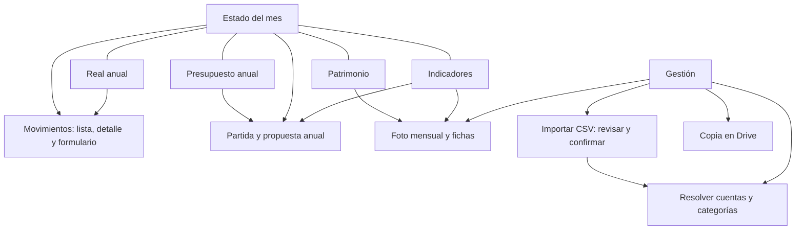

# MA-TSK-013 · Mapa de navegación y arquitectura de información

**Estado:** propuesta de navegación para EP-002; pendiente de validación en el prototipo y aprobación humana del mockup MA-TSK-019. **Alcance:** Windows y Android; no define componentes Flutter ni modifica el contrato financiero. Fuentes: [especificación aprobada](../ep-001/especificacion.md), [contrato CSV](../ep-001/contrato-csv.md) y [casos sintéticos](../ep-001/casos-referencia.md).

## 1. Estructura principal

La aplicación abre en **Estado del mes** con el mes actual de `Europe/Madrid`. Las cinco vistas son destinos principales, accesibles entre sí sin pasar por una pantalla de inicio adicional:

1. Estado del mes (`Estado`)
2. Cuentas, deudas e inversiones (`Patrimonio`)
3. Presupuesto anual (`Presupuesto`)
4. Real anual (`Real`)
5. Indicadores (`Indicadores`)

**PC:** navegación persistente en una barra lateral con los cinco destinos; las acciones de captura y gestión aparecen junto al título o al contexto de la vista. Las matrices anuales se presentan como tablas compactas de doce meses y total. **Android:** navegación inferior con los mismos cinco destinos y los mismos nombres abreviados; cada destino conserva su encabezado, selector de periodo y acciones de contexto. Las matrices anuales se recorren por mes y rama mediante tarjetas, con el total anual siempre identificable. El cambio de formato no cambia rutas, datos ni significado de las cifras.

`Importar CSV`, `Categorías`, `Fichas` y `Copia en Drive` viven en un menú secundario **Gestión** accesible desde cualquier destino. Las acciones de uso frecuente también tienen entrada contextual: `Añadir movimiento` desde Estado o Real; `Crear/editar presupuesto` y `Preparar año siguiente` desde Presupuesto; `Registrar/editar foto` desde Patrimonio; y acciones de completar datos desde Indicadores. No hay transferencia automática al entrar en Drive.

Las líneas entre destinos principales indican cambio de pestaña, no mezcla de periodos ni de cálculos. Los detalles son rutas secundarias y siempre ofrecen volver al contexto desde el que se abrieron.

## 2. Periodos y contexto de navegación

| Vista | Selector visible | Al cambiar el periodo | Al abrir desde otra vista |
|---|---|---|---|
| Estado | Año y mes | Recalcula real y previsto del mes elegido. | Usa el mes de origen si lo hay; si el origen es anual, usa el mes de la celda pulsada. |
| Patrimonio | Año y mes; acceso a los doce meses del año | Consulta la foto del día 1 de ese mes; cada mes muestra su propia completitud. | Conserva el mes de origen; desde una vista anual usa el último mes elegido del mismo año o, si no existe, enero. |
| Presupuesto | Año; mes de la celda o tarjeta al profundizar | Cambia la matriz anual; el detalle conserva el mes concreto. | Desde Estado o Indicadores toma el año del mes de origen y enfoca ese mes. |
| Real | Año; mes de la celda o tarjeta al profundizar | Cambia la matriz anual; el detalle conserva el mes concreto. | Desde Estado toma el año del mes de origen y enfoca ese mes. |
| Indicadores | Año y mes | Recalcula el colchón con la foto de ese mes y el presupuesto de ingresos de ese año. | Conserva el mes de origen; desde una vista anual aplica la misma regla que Patrimonio. |

El primer inicio propone el mes actual de `Europe/Madrid`; después, cambiar entre destinos mantiene el año y mes de trabajo de la sesión. Una selección explícita de periodo tiene prioridad. Si se selecciona otro año en una vista anual, su mes enfocado queda dentro del nuevo año. El selector nunca convierte un saldo mensual en un total anual: Patrimonio permite recorrer doce fotos y muestra «sin dato» donde falte alguna, sin sumar saldos entre meses. En presupuestos, «sin presupuesto» se distingue de `0,00` explícito; en movimientos, un mes vacío muestra real `0,00`.

Cada ruta secundaria recibe un **origen de retorno**: destino, año, mes si procede, rama/celda y filtros de lista. `Volver` devuelve a ese origen; al guardar, también devuelve allí y actualiza las cifras. Si un cambio de fecha mueve un registro fuera del periodo original, se vuelve al mismo periodo y se muestra dónde quedó el registro. Cancelar descarta el formulario y restaura el origen. Al cambiar de destino principal se abre el nuevo destino; su botón `Volver` no recorre una pila de pestañas.

## 3. Rutas conceptuales

Las rutas son identificadores para el prototipo y una futura implementación, no una decisión sobre el enrutador Flutter. `a` es año, `m` es mes de `01` a `12`, `id` identifica una entidad y `rama` es un nodo o «Sin clasificar». La consulta `origen` representa el contexto de retorno descrito arriba; nunca se usa para alterar datos.

| Ruta | Pantalla o estado | Entrada | Retorno |
|---|---|---|---|
| `/estado?a&m` | Estado del mes, ramas y total firmado | Apertura; navegación principal; celda mensual de otra vista | Destino principal, conserva periodo |
| `/patrimonio?a&m` | Fichas, foto del día 1 y totales o pendientes | Navegación principal; acción de Indicadores | Destino principal, conserva periodo |
| `/presupuesto?a` | Matriz anual de partidas | Navegación principal; acción desde Estado o Indicadores | Destino principal, conserva año |
| `/real?a` | Matriz anual de movimientos | Navegación principal; acción desde Estado | Destino principal, conserva año |
| `/indicadores?a&m` | Catálogo de indicadores; inicialmente colchón | Navegación principal | Destino principal, conserva periodo |
| `/movimientos?a&m&rama&origen` | Lista de registros que componen una cifra real; filtros y total firmados | Cifra real o diferencia de Estado; celda de Real; «Sin clasificar» | Cifra/celda original con sus filtros |
| `/movimientos/nuevo?origen` y `/movimientos/:id?origen` | Captura, detalle y edición de un real | Acción de Estado o Real; fila de lista; nuevo desde «Sin clasificar» | Lista o vista de origen; mismo periodo |
| `/presupuesto/partidas?a&m&rama&origen` | Partidas que componen una cifra prevista | Cifra prevista de Estado o celda de Presupuesto | Cifra/celda original |
| `/presupuesto/partidas/nueva?origen` y `/presupuesto/partidas/:id?origen` | Crear, ver o editar partida mensual | Lista de partidas; acción de Presupuesto o Estado | Lista o vista de origen; mismo mes |
| `/presupuesto/propuesta?a&origen` | Propuesta editable para el año `a` a partir del real de `a−1` | «Preparar año siguiente» en Presupuesto | Presupuesto del año de origen al cancelar; del año propuesto tras guardar |
| `/patrimonio/foto?a&m&origen` | Valores manuales de todas las fichas vigentes, incluidos pendientes | «Registrar/editar foto»; aviso «sin dato»; acción de Indicadores | Patrimonio o Indicadores del mismo mes |
| `/patrimonio/fichas?origen` y `/patrimonio/fichas/:id?origen` | Lista, alta, edición y vigencia de cuentas, deudas y carteras | Gestión; foto mensual si falta ficha; aviso del indicador | Gestión o foto/vista de origen |
| `/categorias?origen` y `/categorias/:id?origen` | Árbol, alta y edición hasta tres niveles | Gestión; resolución de importación; selector de categoría en captura | Origen con la selección pendiente preservada |
| `/importar/csv?origen` | Selección de archivo histórico y estado del lote | Gestión → Importar CSV | Origen al cancelar; resumen de importación al confirmar |
| `/importar/csv/revision?origen` | Previsualización, errores, posibles duplicados, asignaciones y confirmación | Archivo seleccionado | Importar CSV para cambiar archivo/corregir; origen tras resultado |
| `/drive?origen` | Versión remota, cambios locales, última operación y dos botones manuales | Gestión → Copia en Drive | Origen sin alterar el periodo |

La ruta `/movimientos` incluye el grupo «Sin clasificar» sin convertirlo en categoría. Una cifra agregada lista cada movimiento de la rama y descendientes una sola vez; una cifra directa lista solo el nodo. La lista deja visible si el filtro es **directo** o **rama completa**. Las cifras de diferencia ofrecen abrir real y presupuesto por separado, pues son entidades distintas. Los detalles conservan cuenta, fecha de valor, signo y Discrecionalidad del movimiento; no hay filtro por Discrecionalidad en esta versión.

## 4. Recorridos de captura y retorno

| Flujo | Entrada principal y pasos | Salida, cancelación y excepciones visibles |
|---|---|---|
| Movimiento manual | Estado/Real → `Añadir movimiento` → fecha de valor, concepto, importe firmado, cuenta, categoría opcional y Discrecionalidad → guardar. Desde una cifra: lista → detalle → editar. | Guardar actualiza Estado/Real según la fecha de valor y vuelve al origen. Cancelar vuelve sin cambios. Categoría vacía aparece en «Sin clasificar» y se puede resolver desde su lista. Las dos piernas de una transferencia, si se desean, se capturan por separado. |
| Categorización | «Sin clasificar» en Estado/Real → lista → movimiento → elegir nodo existente o abrir Categorías → guardar. Gestión → Categorías permite administrar el árbol y marcar ingreso en la raíz. | Guardar vuelve al movimiento o lista original y actualiza la rama; cancelar conserva la asignación anterior. Crear un nodo retorna al selector con el nodo disponible. Nunca se deduce «ingreso» del signo. |
| Partida mensual | Presupuesto o cifra prevista de Estado → mes/rama → crear o editar partida → guardar. | Vuelve a la celda/lista original. Si hay presupuesto simultáneo en un padre y descendiente del mismo mes, se muestra el conflicto y no se guarda; se puede retirar la partida del padre o cancelar. No se exige cuenta. |
| Propuesta anual | Presupuesto del año de origen → «Preparar año siguiente» → revisar los doce meses del año propuesto, importes por raíz, ceros explícitos y alertas de signo → editar o desglosar → guardar. | Cancelar vuelve al año de origen. Guardar valida solapamientos y pide confirmación antes de sustituir partidas existentes; vuelve al año propuesto. Desglosar retira la partida padre del mes antes de guardar. |
| Foto patrimonial | Patrimonio del mes → «Registrar/editar foto» → valores no negativos para fichas vigentes con referencia al día 1 → guardar. Desde Indicadores, el motivo de ausencia abre el mismo mes. Gestión → Fichas permite alta, baja y liquidez. | Vuelve al mes de origen y recalcula Patrimonio e Indicadores. Una foto incompleta sigue mostrando «sin dato» y enumera fichas pendientes; `0,00` cuenta como registrado. Cancelar no arrastra valores de otro mes. |
| Importación histórica | Gestión → Importar CSV → elegir archivo → revisión de filas, signos interno/CSV, altas, referencias, errores y posibles solapamientos → resolver cuentas/categorías → confirmar lote. | `Volver` permite cambiar archivo o asignaciones. No hay confirmación mientras queden errores o referencias pendientes. Cancelar no escribe datos; un lote rechazado no deja altas parciales. Tras éxito o «ya importado», un resumen enlaza Estado, Presupuesto y Real del periodo importado; `Volver` retorna al origen. |
| Copia manual en Drive | Gestión → Copia en Drive → ver fecha y versión remotas **conocidas** (o «desconocida») y estado local → pulsar «Subir copia» o «Descargar última copia». Solo el botón pulsado consulta Drive; descargar presenta la versión remota actual y, si hay cambios locales, confirmación expresa antes de sustituir. | Cancelar descarga conserva la base local. Una subida divergente muestra ambas versiones y ofrece conservar los datos locales o iniciar la descarga manual, sin fusionar. Fallos mantienen la base local o copia remota anterior según la operación; se vuelve a Drive para reintentar desde el botón correspondiente. Salir de la pantalla no inicia una operación. |

Las entradas desde un motivo «sin dato» son específicas: foto ausente o incompleta → foto del mes y fichas pendientes; ingresos presupuestados incompletos, nulos o negativos → Presupuesto del año y meses/partidas afectados. El indicador conserva el periodo elegido al regresar. No se presenta una cifra parcial como patrimonio o colchón válido.

## 5. Comprobación de recorridos con los casos sintéticos

Esta tabla es el guion de revisión del futuro prototipo; no afirma que exista ya una interfaz ejecutable.

| Recorrido a verificar | Caso de referencia | Resultado de navegación esperado |
|---|---|---|
| Importar el CSV de ejemplo, resolver referencias y abrir Estado de enero de 2026 | A, B | Resumen con 48 partidas y 10 reales; Estado muestra total real `+1.229,75` y diferencia `+129,75`; volver conserva enero. |
| Pulsar `Ocio` en Estado y abrir dos «Café» | B, F | Lista de dos registros que suman `−20,00`; detalle y retorno a la misma rama/mes. |
| Pasar de Estado de febrero a Patrimonio e Indicadores | C, D, G | Estado conserva real `+1.099,90`; Patrimonio e Indicadores muestran «sin dato» por falta de foto; la acción lleva a foto de febrero y regresa al mismo mes. |
| Abrir una celda de Presupuesto anual y una de Real anual | E, F | Enero de 2026 abre las partidas o movimientos respectivos, sin mezclar entidades; retorno a la celda de la matriz o tarjeta. |
| Preparar 2027, editar Alimentación y desglosarla | H | La propuesta muestra `−360,00` en enero; el desglose evita padre e hijo simultáneos; cancelar o guardar tiene retorno definido. |
| Subir en Windows, descargar en Android y provocar divergencia | I | Versiones visibles; subida divergente detenida; descarga con cambios locales requiere confirmación y ofrece retorno a Drive. |
| Categorizar un real pendiente y registrar la segunda pierna de una transferencia | J, K | «Sin clasificar» lleva al movimiento; ambas piernas conservan cuentas y signos propios; las cifras actualizadas vuelven al periodo de origen. |

La validación visual y de interacción de estos recorridos corresponde al prototipo de EP-002. La implementación de pantallas Flutter espera la aprobación explícita del mockup MA-TSK-019.
