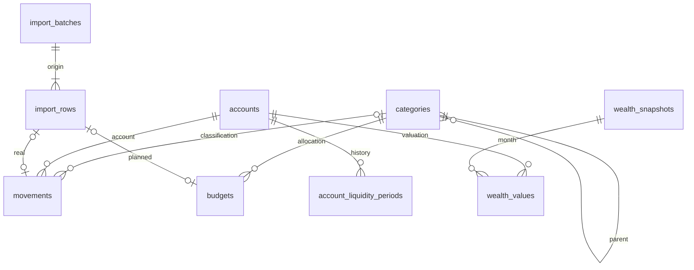

# MA-TSK-031 · Contrato SQLite y migraciones

Contrato de implementación para Drift en Windows y Android. Fuente funcional:
[EP-001](../ep-001/especificacion.md), [CSV v1](../ep-001/contrato-csv.md) y
[casos de referencia](../ep-001/casos-referencia.md). La liquidez histórica se
registra también en [decisiones](../ep-001/decisiones.md). Este ticket define
el esquema objetivo v1; no instala Drift, abre bases ni implementa repositorios,
importadores, informes, Drive o pantallas. No existe una base previa que migrar.

## Tipos y convenciones comunes

- `id`: TEXT NOT NULL PRIMARY KEY, UUID canónico en minúsculas, generado una
  vez (UUID v4) y conservado al editar, migrar y copiar. Validar formato en
  dominio y CHECK de longitud, guiones y caracteres hexadecimales en SQLite.
- Las columnas son NOT NULL salvo las marcadas `?`. Todas las FK usan
  ON DELETE RESTRICT y ON UPDATE RESTRICT; activar foreign_keys en cada conexión.
- `day` es TEXT civil `YYYY-MM-DD`, años 0001–9999, calendario gregoriano real;
  `month` es ese formato con día 01. Sin conversión UTC ni DateTimeColumn de
  Drift para fechas civiles: TextColumn con conversor al tipo de dominio.
  CHECK de formato y día 01 para meses; el dominio valida además calendario
  (no basta una expresión de formato ni la normalización permisiva de SQLite).
- Importes INTEGER en céntimos, IntColumn de Drift: entrada positiva, salida
  negativa en reales y presupuesto. Foto siempre >= 0, incluidas las deudas;
  el pasivo se resta solo al calcular patrimonio. No usar REAL ni decimales
  binarios ni columnas con signos distintos para ahorro/transferencias.
  CHECK typeof(importe) = 'integer'. Admitir enteros firmados de 64 bits,
  comprobar desbordamientos en dominio y agregaciones; nunca convertir una
  suma desbordada a REAL. No negar el mínimo int64 al normalizar un CSV.
- `created_at`, `updated_at`: TEXT UTC ISO con milisegundos y Z, para auditoría
  técnica, nunca para decidir el mes financiero. Nombres/conceptos no vacíos
  tras trim. Textos opcionales conservan discrecionalidad sin interpretación.
- Bools INTEGER con CHECK IN (0,1), enums TEXT con CHECK de valores cerrados.
  Los UUID de origen no se regeneran al descargar otra instalación.

## Tablas y correspondencia funcional

Las columnas comunes de cada entidad UUID incluyen created_at y updated_at.
Los nombres siguientes fijan la traducción entre SQL y tablas Drift.

| Tabla | Columnas específicas | Claves / correspondencia |
|---|---|---|
| categories | id, parent_id? FK categories, name, is_income?, archived (bool) | EP-001 §2. is_income obligatorio 0/1 solo en raíz y NULL en descendientes; se hereda consultando raíz. |
| accounts | id, name, kind (`account`, `portfolio`, `debt`), active_from (month), active_through? (month) | EP-001 §4. Baja inclusiva, CHECK fin >= inicio. Ficha única para movimientos y patrimonio; tipo inmutable tras referencias. |
| account_liquidity_periods | id, account_id FK accounts, from_month, until_month?, liquidity (`liquid`, `medium`, `illiquid`) | EP-001 §4, decisión histórica. Intervalo [inicio, fin); fin NULL abierto; CHECK fin > inicio. UNIQUE(account_id, from_month). |
| import_batches | id, content_sha256, source_kind (`historical_csv`, `bank_xls`), original_name, contract_version, imported_at | EP-001 §7 / CSV. SHA-256 hex minúscula 64 caracteres UNIQUE; solo lotes confirmados, sin bytes bancarios ni rutas privadas. |
| import_rows | id, batch_id FK import_batches, source_ordinal, record_kind (`movement`, `budget`) | UNIQUE(batch_id, source_ordinal), ordinal INTEGER >= 2. Identidad transversal que impide reutilizar una fila en ambos tipos. |
| movements | id, account_id FK accounts, value_date (day), concept, amount_cents, category_id? FK categories, discretion?, import_row_id? FK import_rows | EP-001 §2. Importe != 0. UNIQUE(import_row_id); NULL para manuales. Ninguna unicidad por fecha/concepto/importe. |
| budgets | id, month, category_id FK categories, amount_cents, concept?, discretion?, import_row_id? FK import_rows | EP-001 §3 / CSV. UNIQUE(month, category_id), UNIQUE(import_row_id). Cero explícito válido, sin cuenta. Concepto y discrecionalidad de CSV se conservan. |
| wealth_snapshots | id, month | EP-001 §4. UNIQUE(month). Cabecera permite foto en preparación sin valores; su existencia no implica completitud. |
| wealth_values | id, snapshot_id FK wealth_snapshots, account_id FK accounts, amount_cents | UNIQUE(snapshot_id, account_id), CHECK importe >= 0. Fecha civil procede de cabecera; ningún saldo derivado de movimientos. |
| database_state | singleton INTEGER PK CHECK = 1, dataset_id (UUID TEXT), revision INTEGER >= 0 | Revisión local y linaje de copia, EP-001 §7.1. Una fila; no es versión del esquema. |

No hay tablas de totales, resultados de indicadores, propuestas sin guardar,
transferencias enlazadas o «Sin clasificar». NULL category_id representa esta
última situación. La cabecera de foto incompleta nunca aporta un total válido.

## Restricciones que abarcan varias filas

Drift declarará CHECK, FK, UNIQUE e índices del contrato. Las restricciones
relacionales se implementarán con triggers SQL registrados y versionados en
la migración y validación equivalente en el dominio, con mensajes útiles.
No basta validar la previsualización. Toda escritura de negocio pasa por una
transacción; se rechaza y revierte completa si falla cualquier condición.

1. Categories: triggers BEFORE INSERT/UPDATE parent_id impiden ciclos, padre
   propio y profundidad mayor que tres usando CTE recursiva. Comprobar también
   la profundidad de todo el subárbol al moverlo. No se permite mover ramas ni
   cambiar la marca de ingreso cuando la rama tenga movimientos o presupuestos;
   crear una rama nueva evita reinterpretar datos históricos. Renombrar conserva
   identidad y referencias. No imponer UNIQUE por nombre: las coincidencias
   ambiguas del CSV se resuelven explícitamente; NOCASE no sustituye comparación
   Unicode sin distinción de mayúsculas y trim en el importador.
2. Budgets: triggers BEFORE INSERT/UPDATE de mes o categoría rechazan cualquier
   ancestro/descendiente ya presupuestado en ese mes, excluyendo la propia fila
   en UPDATE. Las hermanas son válidas. Mover categoría debe comprobar también
   conflictos resultantes si aún no hay referencias (regla anterior). Desglosar
   padre requiere retirarlo y escribir hijos dentro de la misma transacción.
3. Liquidez: triggers BEFORE INSERT/UPDATE rechazan deuda, inicio anterior al alta,
   fin posterior al mes siguiente de baja y solape del mismo activo (excluir
   propia fila). Hay solape si `a.from < b.until AND b.from < a.until`, tomando
   NULL como infinito. Para activo con baja conocida, último fin es el mes
   siguiente de baja; para activo sin baja, último fin NULL. El repositorio
   verifica cobertura contigua exacta desde alta al guardar: SQL no valida un
   hueco transitorio entre retirar e insertar periodos. Esa validación debe
   ejecutarse antes de COMMIT para todas las cuentas afectadas. Alta de activo
   crea primer periodo en la misma transacción; cambio desde mes M divide el
   periodo que contiene M y conserva periodos posteriores ya programados.
   Corrección histórica explícita sustituye únicamente el intervalo elegido.
   Actualizar vigencia ajusta cobertura conjuntamente o se rechaza; no elimina
   fotos. Una base importada con huecos se considera inválida, sin presumir
   liquidez ni mostrar un indicador parcial.
4. Movements: trigger exige kind account en la FK, no deuda ni cartera; mes de
   value_date dentro de vigencia inclusiva. Las correcciones históricas dentro
   de vigencia siguen permitidas tras baja. Cambiar vigencia no puede dejar
   movimientos o valores fuera; se rechaza hasta corregir expresamente el dato.
5. Wealth values: trigger exige vigencia en mes de cabecera. Cambiar mes de una
   cabecera con valores se prohíbe; editar importes conserva fecha. Completitud
   es consulta de fichas vigentes menos valores, no flag persistido. Sin valores
   utilizables, incluso sin fichas, resultado foto_ausente según EP-001.
6. Procedencia: triggers comprueban record_kind contra tabla destino y que una
   import_row no esté en ambas. Cada fila del lote confirmado tiene exactamente
   un destino al COMMIT, validado por el coordinador; nunca guardar lotes vacíos
   ni previsualizaciones. La procedencia no se modifica al editar el dato.

## Archivo, baja y borrado

Archivar una categoría no la oculta de consultas históricas, borra referencias
ni cambia su marca. Archivar rama incluye sus descendientes en transacción;
no admite nuevas asignaciones hasta reactivarla, pero permite corregir registros
existentes. No se presupone vigencia histórica de categorías.

Baja de ficha es active_through inclusivo; conserva identidad, periodos,
movimientos y fotos. No se reutiliza una ficha dada de baja para otra cuenta.
Borrar físicamente categorías/fichas solo si no hay referencias ni hijos;
eliminar periodos iniciales de una ficha sin datos exige borrar todo el agregado
en transacción. No hay cascadas que eliminen historia accidentalmente.

Eliminar expresamente un movimiento/partida/valor sí está permitido. Su
import_row y lote permanecen como procedencia de registro eliminado y mantienen
la huella de idempotencia; la exigencia de destino de cada fila se aplica al
confirmar la importación, no tras un borrado explícito. No reimportar bytes para
resucitar eliminados. Eliminar una foto completa requiere borrar sus valores
expresamente en la misma transacción. Los lotes confirmados no se borran.

## Índices y límites de consulta

Además de PK/UNIQUE: categories(parent_id), movements(value_date,id),
movements(account_id,value_date,id), movements(category_id,value_date,id),
budgets(category_id,month), wealth_values(account_id,snapshot_id),
import_rows(batch_id,source_ordinal). El UNIQUE de liquidez cubre cuenta/inicio;
el de fotos cubre mes. Revisar EXPLAIN QUERY PLAN con datos sintéticos al
implementar, sin índices sobre importes o conceptos por anticipación.

Fechas/meses ordenan lexicográficamente por formato fijo. Flujos mensuales usan
`>= primer día AND < primer día siguiente`; año, enero inclusivo a enero
siguiente exclusivo. Vigencia de fichas usa fin inclusivo; liquidez usa fin
exclusivo. Diciembre 9999 requiere límite superior abierto validado, sin
construir año 10000. No derivar el mes con fecha de auditoría.

Listados usan paginación por (value_date,id), orden estable, tamaño predeterminado
100, máximo 500. Rango obligatorio para reales; informes máximo un año por
consulta. Las agregaciones abarcan todas las filas del periodo, no una página.
CTE de categorías hasta tres niveles; sumar cada movimiento una vez. No filtrar
archivados/bajas de un periodo histórico. Ausencia de presupuesto sigue distinta
del cero registrado; no materializar ceros al leer. Propietarios futuros:
wealth para fichas/fotos/liquidez, movements para reales, budget para partidas,
importing para lotes y coordinación; app compone el acceso compartido por
constructor sin introducir dependencias cíclicas ni repositorios en core.

## Versiones, migraciones y copia local

La primera base real se crea con schemaVersion 1; exportar el esquema Drift
con índices y triggers y conservar cada versión en Git. No confundir
PRAGMA user_version con database_state.revision ni con versión remota.
Cambiar esquema requiere incremento y pasos consecutivos explícitos, nunca
recrear la base, resetearla al fallar o editar un snapshot publicado.
Seguir [migraciones Drift](https://drift.simonbinder.eu/migrations/) y
[pruebas de migración](https://drift.simonbinder.eu/migrations/tests/).

Antes de migrar: bloquear escrituras, validar versión y obtener copia consistente
recuperable. Versión superior a soportada: rechazar apertura de escritura sin
alterar archivo. Ejecutar pasos en transacción, usar tablas de la versión del
paso (no modelos actuales para datos antiguos). Para añadir NOT NULL: columna
temporal nullable, transformación explícita justificable, validación, reconstrucción
preservando UUID y referencias. Nunca inventar fotos, cambiar signos o deducir
liquidez histórica desconocida: si falta información, detener y conservar original.
Validar foreign_key_check, integrity_check y reglas de dominio tras migración;
fallo revierte y conserva respaldo. Actualizar versión solo al éxito. No downgrade
automático. Las migraciones técnicas no cuentan como edición financiera.

Cada transacción de negocio incrementa revision una sola vez junto con datos;
rollback/no-op/reimportación idéntica no incrementan. dataset_id se mantiene en
copias/migraciones y cambia solo al crear una base nueva. La instalación guarda
fuera de la base intercambiada su versión remota base y la revisión asociada,
última versión conocida, fecha y resultado: no importar el estado de sincronía
de otro dispositivo. Tokens y credenciales quedan fuera de estos metadatos.

La futura copia consistente captura dataset_id/revision junto con datos usando
SQLite backup API o mecanismo equivalente verificado; copiar solo el fichero
principal mientras existe WAL no es válido. Una escritura posterior deja cambios
locales respecto de la revisión capturada aun si se publica esa copia. Descarga
valida temporal y migra ahí si es compatible, respalda local antes de reemplazar,
cierra conexiones y reabre de forma recuperable. Este contrato no conecta Drive.

## Verificación exigida a la implementación posterior

Crear v1 vacía y probar CHECK/FK/triggers con SQLite real en ambas plataformas.
Cubrir niveles 3/4, ciclos/movimiento de subárbol, marca de ingreso, duplicados
reales legítimos, cero presupuestario, deuda negativa, fechas inválidas, vigencia,
solapes/huecos/cambios de liquidez y variante histórica del caso D. Cubrir
presupuesto padre/hijo en INSERT y UPDATE, hermanas, meses distintos y rollback
del lote; SHA repetida y ordinal transversal. Ejecutar casos EP-001 sin cambios
en cifras originales. Comprobar revisiones, borrados y conservación de procedencia.

Cada futura versión incluye pruebas desde todas las versiones soportadas,
comparación del esquema exportado con creación limpia y fixtures con UUID,
céntimos, nulos, ceros, discrecionalidad, bajas y procedencia. Verificar datos
antes/después, no solo estructura; fallo intermedio debe dejar versión/datos
originales. Probar respaldo con WAL y escritura posterior a captura. Nada de
esto se presenta como probado por este documento.

## Entrega de MA-TSK-031

Verificado el 2026-10-01: toolchain fijado Flutter 3.47.0 / Dart 3.13.0;
check-quality.ps1 completo (formato sin cambios, análisis sin incidencias,
21 pruebas y cuatro variantes APP_ENV); comprobador EP-001 con variante
numérica de liquidez histórica; git diff --check. Sin cambios de dependencias
ni lockfile. No se ejecutan builds nativos porque no cambian plataformas.
No se han probado migraciones ni restricciones en una base Drift real:
este ticket entrega su definición y los criterios para la implementación.
Se utiliza el ticket completo aportado por el usuario; no hay herramienta
Epic Board disponible para consultar o actualizar su estado administrativo.
